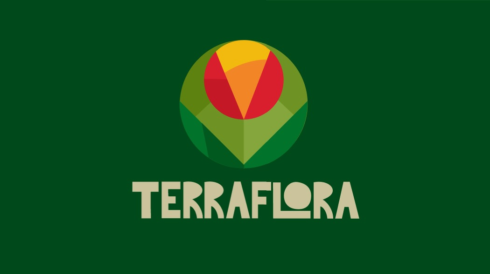

<h1 align="center"> </h1>

O Terraflora é uma plataforma web inovadora, desenvolvida com tecnologias modernas para auxiliar pequenos e médios agricultores no gerenciamento eficiente de suas atividades agrícolas. A aplicação oferece uma gama de ferramentas que facilitam desde o planejamento de safra até a gestão de recursos e monitoramento de condições climáticas.
Com o Terraflora, agricultores podem otimizar o cultivo, aumentar a produtividade e tomar decisões informadas. O sistema oferece controle de inventário, recomendações de plantas, previsões climáticas e acompanhamento completo do ciclo de produção, tudo de forma intuitiva e acessível.

## Funcionalidades Implementadas

- **Descrição de Plantio e Compatibilidade:** Registra os cultivos que o agricultor planeja, com detalhes sobre requisitos de solo e clima, além de sugerir compatibilidades entre as plantas para um plantio mais eficiente.

- **Adição da Lavoura:** Permite adicionar informações sobre a lavoura, como área total e tipos de cultivo, facilitando o planejamento e organização das atividades agrícolas.

- **Divisão da Lavoura:** Divide a lavoura em seções menores para melhor controle e acompanhamento das operações, otimizando recursos e produtividade.

## 💻 Tecnologias Usadas

- **Linguagem de Programação**: 
- **Banco de Dados**: 
- **Framework de Desenvolvimento Web**: 
- **Frontend**: 
- **Organização**: 

## 🖇️Links 
-  [Projeto - Jira](https://cesar-team-omws9jcc.atlassian.net/jira/software/projects/TRF/boards/68/backlog)
- [Site](https://terra-flora.azurewebsites.net/accounts/login/?next=/)
- [Relatório da Programação em Par](https://docs.google.com/document/d/1HrIp963lEQDZbCUSWTN_ieBdo4_9d0Spqt6ZveHgzGc/edit?usp=sharing)
- [Instruções de Uso](https://docs.google.com/document/d/1c1OgO7LOwW2Inl0H0sZEEPRcILvZiO6kl6c-bOLQv3Y/edit?usp=sharing)

## 📦 Entregas

Status Report 1 (SR1)

<ul>
    <li><a href="img/backlog.png">Print do Backlog das histórias</a></li>
    <li><a href="img/sprint1.png">Quadro da Sprint 1 com as Histórias Finalizadas</a></li>
    <li><a href="img/diagrama.png">Diagrama de Atividades</a></li>
    <li><a href="https://www.youtube.com/watch?v=F00l2z5Ead4">Screencast</a></li>
</ul>

## 🙋‍♂️ Criado por:
[Antônio Augusto de Arruda Laprovitera](https://github.com/antoniolaprov)
[Davi Fernando Matias](https://github.com/DaviFernandoMatias)
[Guilherme Vinícius Rangel Silva](https://github.com/GuilhermeRangelSilva)
[Henrique Sérgio Carneiro de Brito](https://github.com/HenriqueCBrito)
[Israel Madureira Duclerc Neto](https://github.com/iduclerc)
[João Rafael Andrade Filgueira](https://github.com/JoaoRafael04)
[Victor Paes Lobo Pereira da Costa](https://github.com/VictorPaes28)
